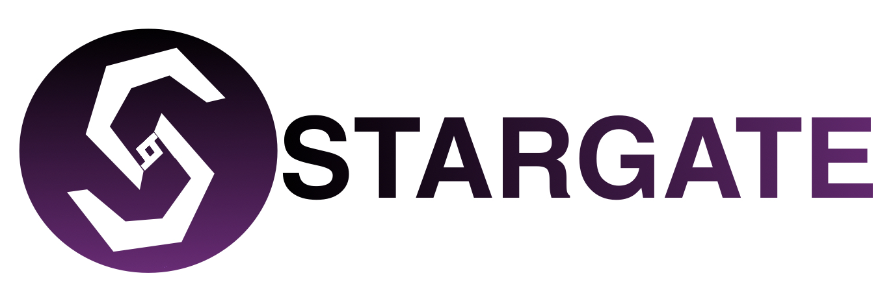
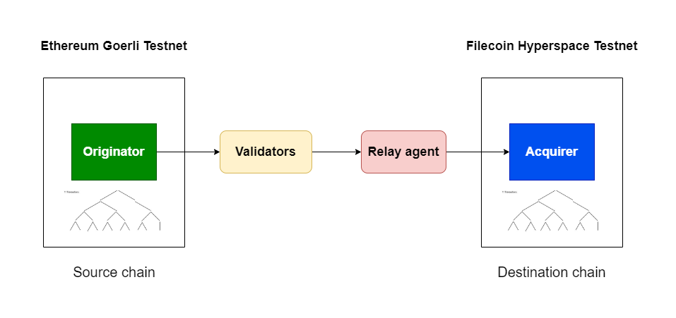

# Stargate

<p align="center">
 
</p>

Cross-chain bridge and interoperability protocol for Filecoin EVM.

In the long run, FVM will eventually be part of a broader family of blockchains. In such a scenario, bridges are necessary between FEVM and EVM chains. Stargate is a cross-chain interoperability protocol. It enables FEVM to be connected to other EVM chains. Stargate is a protocol for cross-chain messaging and interoperability for FEVM. Stargate can be used to send cross-chain messages between FEVM and other EVM chains. It can also be used for implementing cross-chain transactions, wherein Filecoin actors can send transactions that are fulfilled on another EVM chain. Smart contracts sitting on other chains benefit from accessing the storage capabilities of the Filecoin network. Similarly, Filecoin actors should be able to interact with code on other chains, or generate proofs of Filecoin state or events that can be understood by agents sitting on other chains. There are various use-cases and applications which subsequently arise, this includes token and NFT bridging, connecting liquidity across DEX's, cross-chain governance, metaverse interoperability and even chain-agnostic data DAOs. As an example, we demonstrate token bridging between the Goerli testnet and FEVM Hyperspace testnet using the Stargate bridge. We make use of a lock-and-mint mechanism for bridging tokens.

## Architecture

<p align="center">
 
</p>

Merkle trees and proofs are used to verify proof of inclusion of messages on the source and destination chains.

## Using the Stargate Bridge

### Sending messages

Call StargateOriginator Contract with bytes encoded data of the message, from the source chain.

```
 function dispatchMessage(bytes calldata message, address sender) external;
```

### Sending cross-chain transactions

Call StargateOriginator Contract with bytes encoded data of the function, from the source chain.

```
 function dispatchTransaction(bytes calldata _payload, address _target) external;
```

### Receiving messages

Implement the StargateHandler interface in your target contract on the destination chain.

```
 interface IStargateHandler {
    function processMessage(bytes calldata message, address sender) external;
 }
```


## Contract deployment information

**Goerli Testnet**

| Contract | Deployed address  |
| :----- | :- |
| StargateOriginator  | `0xd2DC9CD57134165235DEa8b66e792785aD4F8F35` |
| StargateAcquirer | `0xf10e09c809a1dCA1e7cB43faD4b3d7860EfC33b9`|
| Token | `0x04c2BF100ae20d3214520C7B548049AD6E210bBF`|

**Hyperspace Testnet**

| Contract | Deployed address  |
| :----- | :- |
| StargateOriginator  | `0x176815Dc4dD1E65b76e7430f1E4dC5283B4CbcE0` |
| StargateAcquirer | `0xdcA74ed78491FE09a7808bEcE64053C6B3086739`|
| Token | `0x04c2BF100ae20d3214520C7B548049AD6E210bBF`|


## Setup

#### Install dependencies

```
$ npm install
```

#### Compile contracts

```
$ npm run compile
```

#### Run tests

```
$ npm run test
```

#### Run the development server

```
$ npm run dev
```

#### Start the frontend app

```
$ npm run start
```
